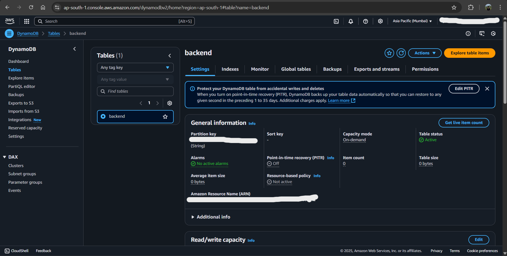

# Terraform AWS Infrastructure with GitLab CI/CD

A modular Terraform project that deploys AWS infrastructure including VPC, EC2 instances, and networking components with automated GitLab CI/CD pipeline.

## 🏗️ Architecture Overview


This project creates:

- **VPC** with public subnet in `ap-south-1a`
- **EC2 Instance** (t2.micro) with Amazon Linux
- **Security Group** allowing SSH access
- **S3 Backend** for Terraform state management
- **DynamoDB** for state locking

 

## 🚀 GitLab CI/CD Pipeline


The pipeline includes 4 stages:

1. **Validate** - Terraform syntax validation
2. **Plan** - Generate execution plan
3. **Apply** - Deploy infrastructure (manual trigger)
4. **Destroy** - Tear down infrastructure (manual trigger)

## 🛠️ Infrastructure Components

### VPC Module

- **CIDR**: `10.0.0.0/16`
- **Public Subnet**: `10.0.1.0/24`
- **Availability Zone**: `ap-south-1a`
- **DNS Support**: Enabled

### Backend Configuration

- **S3 Bucket**: `mystatebucketterraformproject`
- **DynamoDB Table**: `backend`
- **Region**: `ap-south-1`
- **Encryption**: Enabled

## 🚦 Getting Started

### Prerequisites

- AWS Account with appropriate permissions
- GitLab account with CI/CD runner
- Terraform v1.4.2+

### Local Development

```bash
# Clone the repository
git clone <your-repo-url>
cd tera_project

# Initialize Terraform
terraform init

# Plan the deployment
terraform plan

# Apply the changes
terraform apply
```

### GitLab CI/CD Setup

1. Set up GitLab variables:

   - `MY_AWS_ACCESS_KEY`: AWS Access Key ID
   - `MY_SECRET_KEY`: AWS Secret Access Key

2. Ensure S3 bucket and DynamoDB table exist
3. Push to main branch to trigger pipeline
